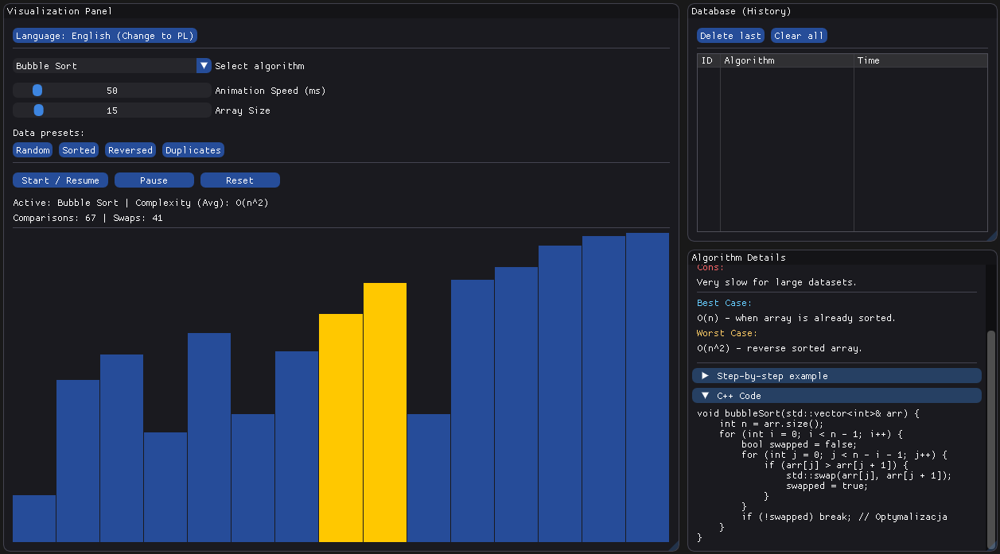
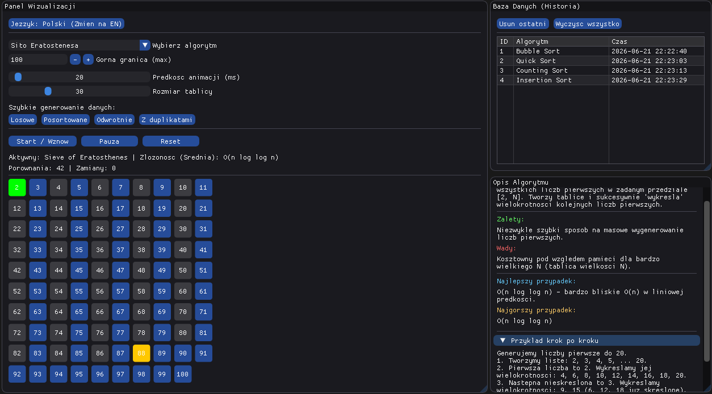

# Sorting Visualizer GUI


An interactive C++17 desktop application that visualizes sorting and search algorithms in real time, built with **Dear ImGui**, **GLFW**, and **OpenGL3**. Built as an academic project to demonstrate algorithmic understanding, a non-blocking GUI architecture, and modern C++ practices — wrapped in a polished, bilingual interface.

Instead of dumping output to a console, the application animates each algorithm step by step on a live bar chart, tracks comparisons and swaps in real time, persists a history of executed operations to a local file-based store, and explains every algorithm's behavior, complexity, and trade-offs directly inside the UI — in both Polish and English, switchable instantly.

---

## Tech Stack

| Layer | Technology | Purpose |
|---|---|---|
| **Language** | C++17 | Core application logic, algorithm implementations |
| **GUI Framework** | [Dear ImGui](https://github.com/ocornut/imgui) | Immediate-mode UI rendering (panels, sliders, tables, modals) |
| **Windowing / Input** | GLFW 3 | Cross-platform window creation and event handling |
| **Rendering Backend** | OpenGL 3.3 | Hardware-accelerated drawing surface for ImGui |
| **Build System** | CMake ≥ 3.16 | Cross-platform build configuration |
| **Data Persistence** | Plain text file I/O (`history.txt`) | Lightweight, dependency-free history store |

No external GUI toolkit installer, no Qt runtime, no database engine — the entire stack compiles down to a single native executable with minimal dependencies (GLFW + OpenGL only).

---

## Features

- **Live, non-blocking visualization** — array elements rendered as colored bars that animate as the algorithm runs, without ever freezing the window.
- **8 algorithms implemented:**
  - **Sorting:** Bubble Sort, Insertion Sort, Merge Sort, Quick Sort (iterative), Heap Sort, Counting Sort
  - **Searching / Math:** Binary Search, Sieve of Eratosthenes
- **Step-based execution engine** — every algorithm is driven by a `step()` call per frame instead of blocking with `sleep()`, keeping the UI fully responsive at all times.
- **Live statistics** — real-time comparison and swap counters displayed during execution.
- **Configurable controls** — sliders for animation speed and array size, plus one-click data presets: Random, Sorted, Reverse-sorted, and Duplicates (useful for demonstrating best/worst-case behavior, e.g. Quick Sort degrading on reverse-sorted input).
- **Educational side panel** — a collapsible panel per algorithm showing its description, advantages, disadvantages, best/average/worst-case complexity, a step-by-step walkthrough, and the actual C++ source snippet used in the implementation.
- **Persistent history database** — every completed run (algorithm, data size, timestamp) is logged to a local `history.txt` file with a 15-entry cap and duplicate prevention. On startup, if previous history is found, the user is prompted via a modal dialog to either continue appending or clear the file.
- **History management panel** — view all entries in a table, delete the last entry, delete by index, or clear everything.
- **Full PL/EN localization** — the entire interface, including algorithm explanations, switches between Polish and English instantly via a single button, no restart required.
- **Clean, stable interface** — `imgui.ini` layout persistence is disabled so the UI always launches in the same consistent, polished state.

> **Scope note:** a side-by-side "Race Mode" comparing two algorithms simultaneously was planned but intentionally dropped to prioritize stability and polish of the core feature set ahead of the deadline.

---

## Screenshots

The main window is split into three panels: algorithm controls and the live bar-chart visualization on the left, the persistent operation history on the top right, and the educational algorithm panel (description, complexity, pros/cons, step walkthrough, and source code) on the bottom right.

**Main Visualization Panel (Bubble Sort)**


**Educational Panel & Sieve of Eratosthenes**


---

## Architecture

### The problem: immediate-mode GUI vs. blocking algorithms

Dear ImGui renders in an **immediate-mode loop** — the entire UI is redrawn from scratch every frame, dozens of times per second. If a sorting function executed its full logic in a single call, even with `std::this_thread::sleep_for()` between comparisons to "animate" it, it would block the thread responsible for rendering. The result: a frozen, unresponsive window for the entire duration of the sort, with no way to interact with sliders, buttons, or even close the application gracefully.

### The solution: algorithms as state machines

Every algorithm is implemented as an explicit **state machine** rather than a single blocking function:

1. Progress is stored as **member fields** (loop indices, pivot position, an explicit stack of sub-ranges) instead of local variables scoped to a `for`/`while` loop.
2. A `step()` method performs **exactly one unit of work** — one comparison, one swap, one heapify operation — then returns control to the caller.
3. The main application loop calls `step()` at a rate controlled by the speed slider (timed via `ImGui::GetTime()`), interleaved with normal frame rendering and input handling.

This decouples the render loop from algorithm logic entirely: the window keeps redrawing at full framerate regardless of visualization speed, and the UI remains interactive — pausable, resettable, reconfigurable — at every single step.

```
┌────────────────────────────────────────────────────┐
│                 Main Application Loop                │
│                                                        │
│   every frame:                                        │
│     ImGui_ImplOpenGL3_NewFrame()                       │
│     ImGui_ImplGlfw_NewFrame()                          │
│     ImGui::NewFrame()                                  │
│                                                          │
│     if (!paused && elapsed >= speed_interval_ms)        │
│         finished = activeAlgorithm->step()   ◄─ ONE op  │
│                                                          │
│     drawBars(activeAlgorithm->getData(),                │
│               activeAlgorithm->getHighlighted())         │
│     drawHistoryPanel(database.getEntries())              │
│     drawEducationPanel(AlgorithmInfo::get(activeName))   │
│                                                          │
│     ImGui::Render()                                     │
│     glfwSwapBuffers(window)                              │
│                                                          │
└────────────────────────────────────────────────────┘
```

#### Algorithms with non-trivial control flow

Two algorithms don't map naturally onto a simple iterative `step()`:

- **Quick Sort** is recursive by nature, and recursion can't be "paused" mid-call from the outside. It's implemented **iteratively**, using an explicit `std::vector<std::pair<int,int>>` as a stack of `(low, high)` sub-ranges — pushed and popped exactly as the call stack would be, but under the application's own control.
- **Merge Sort** uses a **record-and-replay** approach: the full merge sequence is computed once during `init()` into an ordered list of array snapshots; `step()` simply advances through that pre-recorded sequence one frame at a time. This keeps the recursive merge logic simple and correct while still presenting a smooth, controllable animation.

### Core interface contract

```cpp
class ISortAlgorithm {
public:
    virtual void init(std::vector<int> data) = 0;
    virtual bool step() = 0;                    // wykonuje JEDEN krok, zwraca false gdy koniec
    virtual const std::vector<int>& getData() const = 0;
    virtual std::pair<int,int> getHighlighted() const = 0;
    virtual int getComparisons() const = 0;
    virtual int getSwaps() const = 0;
    virtual std::string getName() const = 0;
    virtual std::string getComplexity() const = 0;
    virtual bool isFinished() const = 0;
};
```

Every sorting algorithm in `sorting/` implements this interface, which lets the application hold them polymorphically (`std::vector<std::unique_ptr<ISortAlgorithm>>`) and switch between them at runtime through a single dropdown, with zero `if/else` chains on algorithm type in the UI code.

### Full module architecture

```
sorting-visualizer-gui/
│
├── CMakeLists.txt
├── README.md
├── LICENSE
├── history.txt                     # persisted run history (generated at runtime)
│
├── external/
│   └── imgui/                          # Dear ImGui core + GLFW/OpenGL3 backends
│
├── include/sv/
│   │
│   ├── core/
│   │   ├── Localization.hpp            # PL/EN string table + tr(key) lookup
│   │   └── Theme.hpp                   # ImGuiStyle colors, rounding, fonts
│   │
│   ├── sorting/
│   │   ├── ISortAlgorithm.hpp          # step-based interface (see above)
│   │   ├── BubbleSort.hpp
│   │   ├── InsertionSort.hpp
│   │   ├── MergeSort.hpp               # record-and-replay implementation
│   │   ├── QuickSort.hpp               # iterative, explicit stack
│   │   ├── HeapSort.hpp
│   │   └── CountingSort.hpp            # range-bounded, non-comparison sort
│   │
│   ├── math_algs/
│   │   ├── BinarySearch.hpp
│   │   └── SieveOfEratosthenes.hpp
│   │
│   ├── database/
│   │   ├── HistoryEntry.hpp            # struct: index, algorithm, timestamp, dataSize
│   │   └── HistoryDatabase.hpp         # load/save/validate, no UI dependency
│   │
│   └── utils/
│       ├── RandomGenerator.hpp         # data presets: random/sorted/reverse/duplicates
│       └── AlgorithmInfo.hpp           # PL+EN descriptions, complexity, source snippets
│
├── src/                                # .cpp implementations mirroring include/sv/
│   ├── main.cpp                        # entry point: creates App, calls run()
│   ├── core/
│   ├── sorting/
│   ├── math_algs/
│   ├── database/
│   └── utils/
│
└── data/
    
```

### Module responsibilities

| Module | Responsibility | Key design decision |
|---|---|---|
| `core/` | Owns the GLFW window, the ImGui context, and the main loop directly inside main.cpp
| `sorting/` | Algorithm implementations | All implement `ISortAlgorithm`; polymorphism replaces `switch`/`if-else` on algorithm type |
| `math_algs/` | Binary Search, Sieve of Eratosthenes | Same step-based pattern as `sorting/`, kept in a separate namespace since they aren't sorts |
| `database/` | Reads/writes/validates `history.txt` | **Zero dependency on ImGui or rendering code** — operates purely on `std::vector<HistoryEntry>` and `std::ifstream`/`std::ofstream`, which keeps it independently testable |
| `utils/` | Shared, stateless helpers | `RandomGenerator` for data presets; `AlgorithmInfo` as a static lookup table of bilingual educational content |

### Data flow for a single sorting run

```
User selects algorithm (Combo) + clicks preset (e.g. "Reverse")
        │
        ▼
RandomGenerator generates std::vector<int>
        │
        ▼
activeAlgorithm->init(data)        // state reset, fields populated
        │
        ▼
User clicks "Start"
        │
        ▼
┌─── main loop ───────────────────────┐
│  every speed_interval_ms:            │
│    activeAlgorithm->step()           │
│    drawBars(getData(), highlighted)  │
└──────────────────────────────────────┘
        │
        ▼  (step() returns false → finished)
HistoryDatabase::save(HistoryEntry{...})
        │  ├─ rejects if duplicate algorithm name present
        │  └─ evicts oldest entry if count > 15
        ▼
History panel refreshes via getEntries()
```

---

## Database / Persistence Layer

The "database" is a deliberately lightweight, dependency-free file store — no SQL engine, no ORM, just structured plain text and disciplined validation logic:

- **Format:** one entry per line, semicolon-delimited (`index;algorithm;timestamp;dataSize`)
- **Cap:** maximum 15 entries; the file never grows unbounded
- **Duplicate prevention:** a new entry is rejected if an entry for the same algorithm already exists, unless the previous one was explicitly removed first
- **Startup behavior:** if `history.txt` is non-empty on launch, a modal dialog asks the user to either continue appending to the existing history or clear the file entirely
- **Management UI:** a dedicated panel lists all entries in a table and supports removing the last entry, removing by index, or clearing everything

This module is intentionally isolated from `core/` and the rendering layer — it can be reasoned about and tested purely in terms of file contents in, file contents out.

---

## Requirements

- **C++17**-compliant compiler (GCC ≥ 9, Clang ≥ 10, or MSVC ≥ 2019)
- **CMake** ≥ 3.16
- **GLFW3** (development headers + library)
- **OpenGL** (system-provided on Windows/Linux/macOS)
- Dear ImGui sources (bundled under `external/imgui/`, no separate install needed)

### Installing GLFW

```bash
# Debian / Ubuntu
sudo apt install libglfw3-dev

# macOS (Homebrew)
brew install glfw

# Windows (via vcpkg)
vcpkg install glfw3
```

---

## Building

```bash
git clone https://github.com/<your-username>/sorting-visualizer-gui.git
cd sorting-visualizer-gui

mkdir build && cd build
cmake ..
cmake --build . --config Release
```

On Windows with vcpkg, pass the toolchain file explicitly:

```bash
cmake .. -DCMAKE_TOOLCHAIN_FILE=[vcpkg_root]/scripts/buildsystems/vcpkg.cmake
```

### Running

```bash
# from the build directory
./sorting_visualizer        # Linux / macOS
sorting_visualizer.exe      # Windows
```

On first launch, if `data/history.txt` already contains entries from a previous session, you'll be prompted to either continue appending to the existing history or clear it.

---

## Roadmap / Possible Extensions

- [ ] **Race Mode** — side-by-side comparison of two algorithms on identical input, scored by step count (scoped out of v1.0 to prioritize stability)
- [ ] Radix Sort / Bucket Sort as additional non-comparison sorts
- [ ] Export sorted result / run statistics to `.txt` or `.csv`
- [ ] Persisted user preferences (last language, last speed/size settings)

---

## License

MIT — see `LICENSE` for details.
